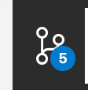
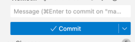
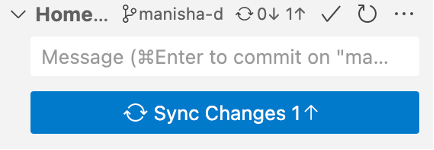
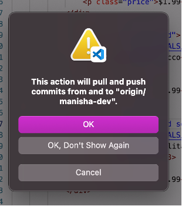
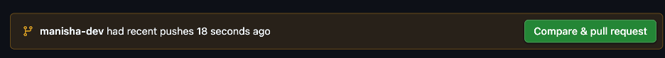
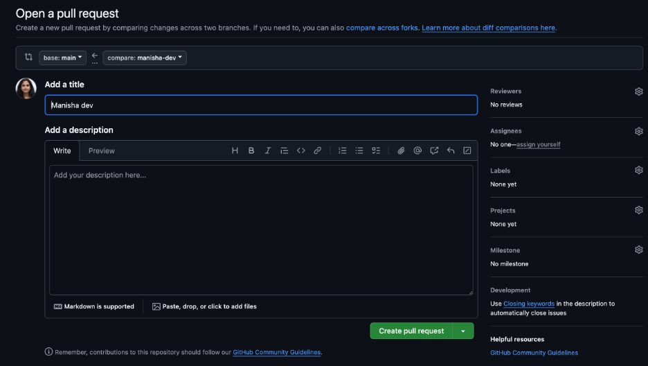
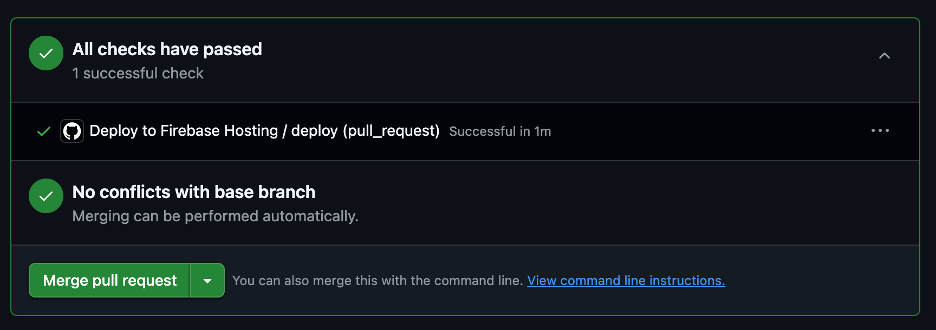
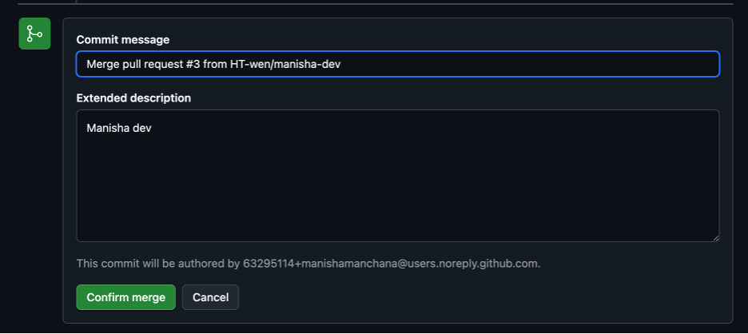

# ✅ How to Safely Make Changes to the Website Repository (For Beginners)

> ❗ **Never make changes directly in the `main` branch.**  
> Always create your own **branch** and work in it. This ensures the live website isn’t accidentally broken.

---

## 🔧 Step-by-Step: Creating and Using Your Own Branch

### 🟢 Step 1: Make sure you’re on the latest `main` branch

Open your terminal or Git Bash and run:

```bash
git checkout main
git pull origin main
```

> This will ensure you have the most up-to-date version of the live website.

---

### 🟡 Step 2: Create and switch to your own branch

```bash
git checkout -b yourname-dev
```

Replace `yourname-dev` with your name.  
For example, Manisha used:

```bash
git checkout -b manisha-dev
```

---

### 🟠 Step 3: Push your new branch to GitHub

```bash
git push origin yourname-dev
```

You are now working in your own branch — safe from affecting the live website.

---

## 💻 Making Code Changes in VS Code

### Step 1: Open Source Control (Git) in VS Code

Look at the bottom left of VS Code — you’ll see an icon like a **forked branch with a number**.  
Click on it.



---

### Step 2: Write a commit message

Type a short message describing what you changed.  
Examples:
- `Added new images to gallery`
- `Fixed homepage scroll bug`

Then click ✅ **Commit**.



---

### Step 3: Push (Sync Changes)

After committing, a blue **"Sync Changes"** button appears. Click it.  
If a popup asks to confirm, click **"OK"**.




---

## 🔁 Creating a Pull Request (to Merge Changes to Live Site)

1. Go to the repository on GitHub  
Example: [https://github.com/HT-wen/Hometown_website](https://github.com/HT-wen/Hometown_website)


2. You’ll see a **"Compare & pull request"** message — click it.



3. Click on **"Create pull request"**



4. Wait for **2 green checks** ✅ ✅ (CI checks to pass)
5. Click **"Merge pull request"**


6. Then click **"Confirm merge"**


🎉 Your changes are now merged. The deployment to the live site happens automatically.

---

## 🛒 Marking an Item as SOLD OUT on Homepage

To mark a product as **sold out** in the **Trending & Best Sellers** section:

1. Find the HTML block like:

```html
<div class="product-card">
```

2. Change it to:

```html
<div class="product-card sold-out">
```

> This will apply a “Sold Out” label to that product.

---

## 🎯 Summary of Git Commands

```bash
# Step 1: Update main
git checkout main
git pull origin main

# Step 2: Create your own branch
git checkout -b yourname-dev

# Step 3: Push your branch
git push origin yourname-dev
```

---

